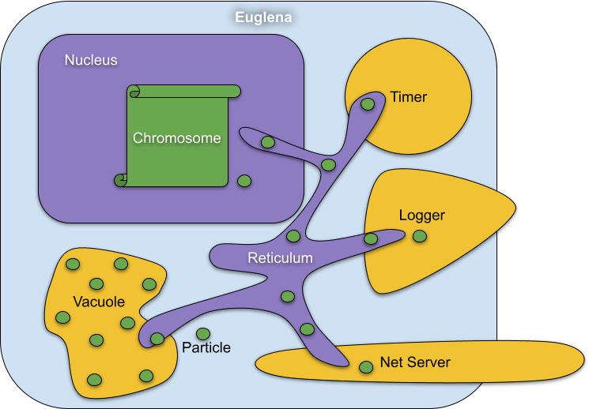

## Euglena

Euglena is an open source framewaork to make developers' coding routine more strict, problems more predictable, efforts
less. It has event driven architecture with enhanced side features. Mostly focused onto those below difficulties:

    * Dependency injection
    * Code reusability
    * Logic reusability
    * Logic update at runtime

An euglena application consists of three main part. Organelles, Particles, Genes.

### Organelle

Organelles are functionalities of the application. Such as birds need wings to fly, euglenas need organelles to do
something. As well as an euglena in the mother nature has flagellum organelle to move around, vacuole organelle to keep
waste together, mitocondri organelle to produce ATP, in the digital nature here an euglena has net-server organelle to
listen requests, vacuole organelle again to store particles, logger organelle to log. Straight forward right ?

Except for two, all organelles are not necessarily needed to be included in a euglena application. These two organelles
are endoplasmic reticulum and nucleus. Whereas endoplasmic reticulum is responsible from delivery of particles, nucleus
keeps chromosome (genes) and trigger actions corresponding to a gene when a particle is received.

In the architecture, considering code reusability and serializability organelles are reachable through their interfaces
to establish loose coupling to the dependencies. This means you can implement in a lots of ways one organelle interface.
For example, memory, file system, database, all keep particles which means data. Hence these all can be a different
implementation of the same organelle, which is named vacuole. Interface means the definitions of what kind of particles
the organelle can take in and give off.

### Particle

Particles are data objects to store event information and command either. However, it doesn't matter what they carry,
they are just piece of data. And particles consist of two parts which are "meta" and "data". Predictably "meta" keeps
data about the part "data". Meta has one must have record "class". Class basicly is identity of the particle.

    {
      "meta":{
         "class": "Log"
      },
      "data":{
         "level": "info",
         "message": "Hello World"
      }
    }

### Gene

A gene is a serializable code block which is the logic behind how euglena will behave inorder to respond to an event. A
gene is represented as javascript object below.

    {
      "meta":{
        "class": "Gene"
      },
      "data":{
        "name": "When got exception, do something",
        "triggers": { "meta": { "class": "Exception" } },
        "reaction": async (p, s, { t })=>{
          //Exception particle is received
          //Do something
        },
      }
    }

As you see "data" has some properties. "name" stands for the description of the gene. "triggers" declares what kind of
particle this gene will respond to. "reaction" is the function where we put the logic. If you catch it takes 3
parameters. p represents particle which is received. In this case it is Exception particle. s represents source
organelle. Each particle travels inside the euglena created by an organelle. The source is name of this organelle. Third
parameter is an object keeps tools. t is shown above is a function to transmit particles from nucleus to target
organelle. Below there is an sample for inside of a reaction. A log particle was defined with the information from the
exception particle. Then it is transmitted to the organelle "LoggerConsole".

    const logParticle = {
      "meta": { "class": "Log" },
      "data": { "level": "error", "message": particle.data.message }
    }
    t(logParticle,"LoggerConsole")

Caution:

-   When writing gene, be aware of that there should not be any global variable or any library reference being consumed
    by genes. Each gene should be seperate from each other and also isolated from the environment.

TODO :

-   Tell about gene override
-   In the near future There will be a store under euglena.codeloves.me/store to expose organelle implementations and
    genes
-   should print log when transmitting particle to a organelle (debug mode)
-   debug mode - to trace flow of particles throuch the organelles and genes. Can be on / off according to developers'
    desire. When off no log except logger organelle printing. This means no internal prints.
-   Sample project creation video for all types; node, react,angular,organelle

### Packages

[@euglena/cli](packages/cli/README.md)

[@euglena/core](packages/core/README.md)

[@euglena/organelle.bcrypt.bcrypt](packages/organelle.bcrypt.bcrypt/README.md)

[@euglena/organelle.fs.nodejs](packages/organelle.fs.nodejs/README.md)

[@euglena/organelle.gps.serial-port](packages/organelle.gps.serial-port/README.md)

[@euglena/organelle.http-client.axios](packages/organelle.http-client.axios/README.md)

[@euglena/organelle.jwt.jsonwebtoken](packages/organelle.jwt.jsonwebtoken/README.md)

[@euglena/organelle.logger.console](packages/organelle.logger.console/README.md)

[@euglena/organelle.matter-sensor.plantower](packages/organelle.matter-sensor.plantower/README.md)

[@euglena/organelle.net-client.browser](packages/organelle.net-client.browser/README.md)

[@euglena/organelle.net-client.nodejs](packages/organelle.net-client.nodejs/README.md)

[@euglena/organelle.net-server.nodejs](packages/organelle.net-server.nodejs/README.md)

[@euglena/organelle.thermometer.i2c](packages/organelle.thermometer.i2c/README.md)

[@euglena/organelle.timer.js](packages/organelle.timer.js/README.md)

[@euglena/organelle.ui.react](packages/organelle.ui.react/README.md)

[@euglena/organelle.vacuole.js](packages/organelle.vacuole.js/README.md)

[@euglena/organelle.vacuole.mongodb](packages/organelle.vacuole.mongodb/README.md)

[@euglena/organelle.vacuole.nedb](packages/organelle.vacuole.nedb/README.md)

[@euglena/organelle.web-server.express](packages/organelle.web-server.express/README.md)

[@euglena/organelle.script](packages/organelle.script/README.md)
