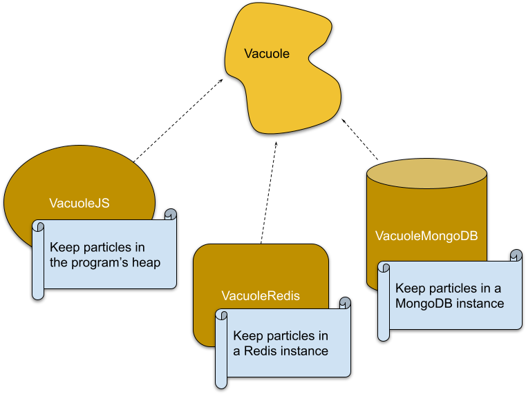

## Euglena

Euglena is an event driven architecture with enhanced side features. Mostly focused onto those below difficulties:

    * Dependency injection
    * Code reusability
    * Logic reusability
    * Logic update at runtime

An euglena application consists of three main part. Organelles, Chromosome, Particles.

Organelles are functionalities of the application. Such as birds need wings to fly, euglenas need organelles to do
something. As well as an euglena in the mother nature has flagellum organelle to move around, vacuole organelle to keep
waste together, mitocondri organelle to produce ATP, in the digital nature here an euglena has net-server organelle to
listen requests, vacuole organelle again to store particles, logger organelle to log. Straight forward right ?

Except for two, all organelles are not necessarily needed to be included in a euglena application. These two organelles
are endoplasmic reticulum and nucleus. Whereas endoplasmic reticulum is responsible from delivery of particles, nucleus
keeps chromosome (genes) and trigger actions corresponding to a gene when a particle is received.

In the architecture, considering code reusability and serializability organelles are reachable through their interfaces
to establish loose coupling to the dependencies. This means you can implement in a lots of ways one organelle interface.
For example, memory, file system, database, all keep particles which means data. Hence these all can be a different
implementation of the same organelle, which is named vacuole. Interface means the definitions of what kind of particles
the organelle can take in and give off.

Particles are data objects to store event information and command either. However, it doesn't matter what they carry,
they are just piece of data. And particles consist of two parts which are "meta" and "data". Predictably "meta" keeps
data about the part "data". Meta has one must have record "class". Class basicly is identity of the particle.

    {
      "meta":{
         "class": "Log"
      },
      "data":{
         "level": "info",
         "message": "Hello World"
      }
    }

### Packages

[@euglena/cli](packages/cli/README.md)

[@euglena/core](packages/core/README.md)

[@euglena/organelle.gps.serial-port](packages/organelle.gps.serial-port/README.md)

[@euglena/organelle.logger.console](packages/organelle.logger.console/README.md)

[@euglena/organelle.matter.plantower](packages/organelle.matter.plantower/README.md)

[@euglena/organelle.net-client.browser](packages/organelle.net-client.browser/README.md)

[@euglena/organelle.net-client.nodejs](packages/organelle.net-client.nodejs/README.md)

[@euglena/organelle.net-server](packages/organelle.net-server/README.md)

[@euglena/organelle.temperature](packages/organelle.temperature/README.md)

[@euglena/organelle.temperature.i2c](packages/organelle.temperature.i2c/README.md)

[@euglena/organelle.timer.js](packages/organelle.timer.js/README.md)

[@euglena/organelle.ui.react](packages/organelle.ui.react/README.md)

[@euglena/organelle.vacuole.js](packages/organelle.vacuole.js/README.md)

[@euglena/organelle.vacuole.mongodb](packages/organelle.vacuole.mongodb/README.md)

[@euglena/organelle.vacuole.nedb](packages/organelle.vacuole.nedb/README.md)
